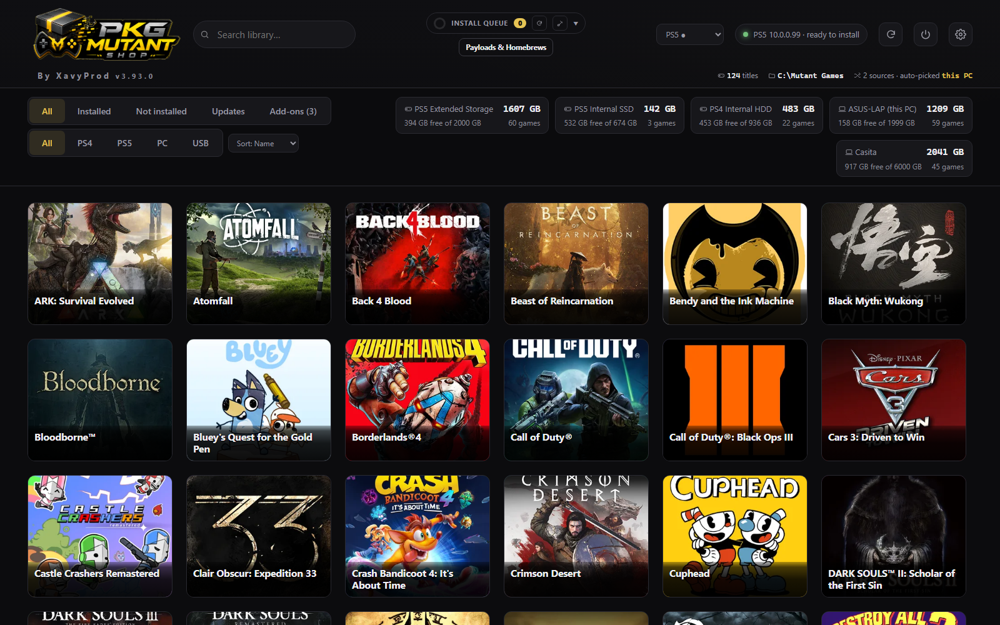
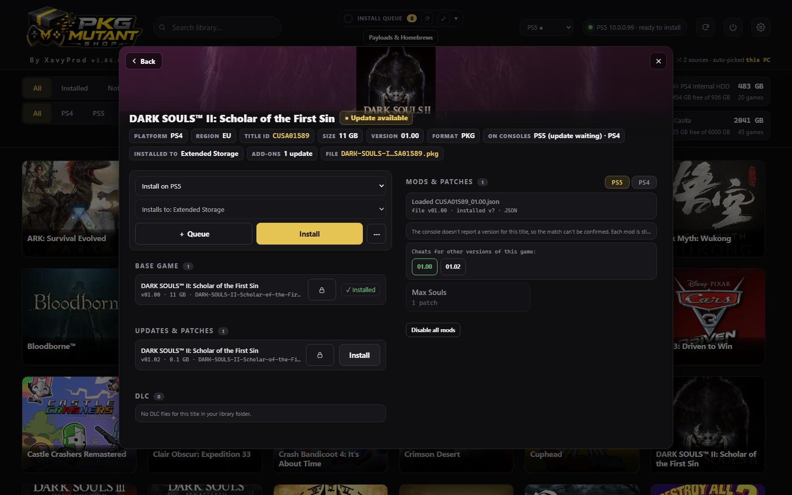
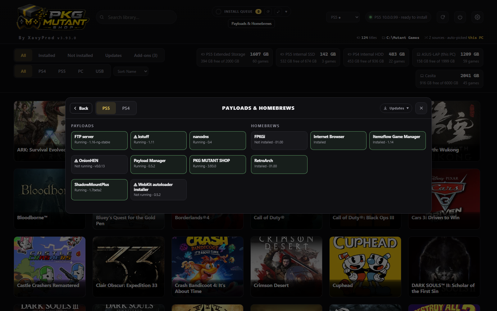
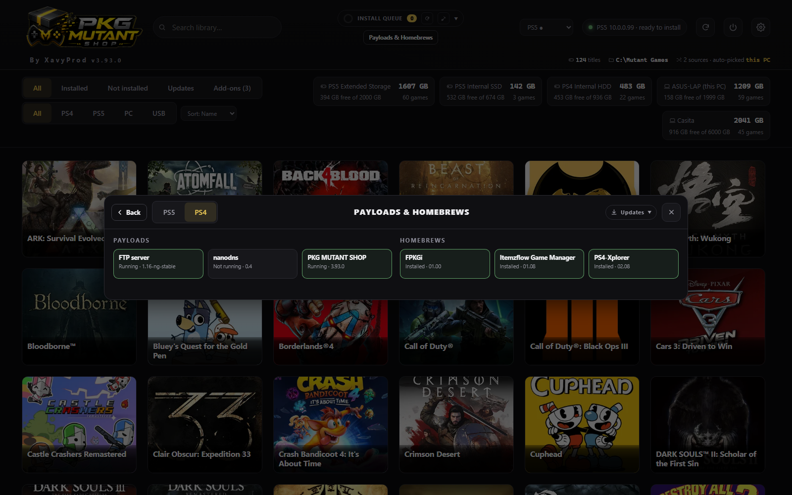

<div align="center">

# PKG MUTANT SHOP

**One app. Two jailbroken consoles. Every device in the house.**

A homebrew package manager and store front-end for a jailbroken **PlayStation 5** and
**PlayStation 4** — browse a library, see each game's updates, DLC, cheats and patches, and install
straight to the console: from the console itself, from a PC, or from a phone.

[](CHANGELOG.md)
[](#supported-firmware)
[](#supported-firmware)
[](LICENSE)
[](#fifteen-languages)



</div>

---

## What you get

|   |   |
|---|---|
| **Two consoles, one app** | A PS5 payload and a PS4 payload — one binary cannot run on both, which was measured, not assumed — behind one UI, one companion, one queue, one set of build gates. Both consoles get an icon on their home screen. |
| **Installs through Sony's own installer** | The console downloads each package *itself*, over HTTP Range, through BGFT. The PC serves bytes and keeps the queue; it never pushes a game over FTP. |
| **A verdict you can trust** | "Installed" means a `bgft.db` status of **1036** (base) or **1026** (update/DLC) *and* a full-size `app.pkg` on disk. A row in `app.db` alone is never treated as proof. |
| **Cheats and patches, live** | Applied to the *running* game by our own engine — expect-gated and revertable. Thousands of cheat files ship inside the app. |
| **Payloads & Homebrews** | Send payload ELFs to either console and install homebrew packages through the same engine the games use — and update them from their own upstream GitHub releases. |
| **Every device is one fleet** | Companions find each other on the LAN. A PC that does not hold a file can still press the button: whoever has the bytes is asked. |
| **Works with the PC switched off** | All three artifacts carry the UI, the payload set, the catalogue and the cheat library. A console on its own is not a degraded mode. |

---

## Screenshots

<table>
<tr>
<td width="50%"><br><sub><b>A game's panel</b> — base game, updates, DLC, add-ons, and the mods that match this exact game version.</sub></td>
<td width="50%"><br><sub><b>Payloads &amp; Homebrews</b> — a tile is green only when a port answered or the loader listed the process.</sub></td>
</tr>
<tr>
<td width="50%"><br><sub><b>The same panel, PS4</b> — its own payloads, its own homebrews, taken from the folder layout.</sub></td>
<td width="50%"><br><sub><b>The library</b> — every drive on both consoles, and every PC in the fleet, with free space.</sub></td>
</tr>
</table>

---

## What this is, and what it is not

**It is** a source-agnostic installer and manager. You configure your own content sources — a folder
on your PC served over HTTP, another PC running the same app, or your own self-hosted
`sources.json`. The app groups everything by game (base / update / DLC), shows install state, and
hands install jobs to the console.

**It is not** a scraper for any piracy site, and it ships **no bundled catalogue of copyrighted
games**. You point it at content you have the right to install. That keeps the tool clean, legal to
develop, and resilient — no dependency on some site's HTML staying the same.

**What it does ship besides its own code:** a cheat and patch library (json / shn / mc4 cheats and
patch XML, from the GPL-3.0 HEN-Cheats-Collection, credits inside each file), ShadowMountPlus, and
the helper payloads listed in the panel. Origins and licences are in
[THIRD-PARTY-NOTICES.md](THIRD-PARTY-NOTICES.md).

---

## Supported firmware

| Console | Firmware | Jailbreak | Needs |
|---|---|---|---|
| PlayStation 5 | 12.70 | Y2JB / Kstuff | **Payload Manager** on `:8084` — the jailbreak's own loader. Nothing else. |
| PlayStation 4 | 13.52 | GoldHEN | GoldHEN's payload loader. The home-screen icon then reloads the app without a PC. |

> **Never update the console.** A system update removes the jailbreak. This app never starts,
> resumes or cancels a console-owned transfer, and it can block Sony's update hosts if you point the
> console's DNS at the companion.

---

## Run it

**On a PC** — run `PKG-MUTANT-SHOP.exe`. It creates `C:\Mutant Games\PS4` and `\PS5`, scans them,
finds the consoles on the LAN, opens <http://localhost:8710> and sits in the tray. `config.json` is
written beside the exe. Drop `.pkg` files into the folders.

**On the PS5** — with Payload Manager running, load `PKG-MUTANT-SHOP.elf` from it. The ELF writes
the UI, starts ShadowMountPlus if it is not already up, puts the **PKG MUTANT SHOP** tile under
Media if it is missing, and toasts that it is ready.

**On the PS4** — load `PKG-MUTANT-SHOP-PS4.elf` through GoldHEN, or press the home-screen icon. The
payload installs and updates that icon itself, from inside the ELF, with every PC switched off.

**From source** — `python companion/server.py` (Python 3.8+, standard library only; Pillow optional,
for card thumbnails and the tray icon), or `start.cmd`.

Ports, config keys, adding a second PC, triage: **[SETUP.md](SETUP.md)**.

---

## Updating

The app checks its own releases and offers them **in the Payloads & Homebrews panel**, on the PKG
MUTANT SHOP tile, exactly the way it offers a new ftpsrv or nanoDNS. The download is verified before
anything is replaced: the size must match, the marker must be present *inside* the bytes, and the
old file is kept as `.bak` until the new one is proven complete. Taking an update replaces the file;
sending it to a console stays a second, separate press.

Nothing needs configuring for this: the releases are public, so any device finds them. Not every
version is published — only the ones worth interrupting someone for.

---

## How installing actually works

1. **Install** is pressed on any device. The PC's queue claims the job — one running install per
   console.
2. The PC asks the console:
   `GET http://<console>:8710/api/engine/install-spawn?uri=http://<pc>:8710/library/<key>&name=…`
3. The ELF writes the request, writes its embedded `pms-installer.elf` into Payload Manager's own
   directory, and asks Payload Manager to **spawn** it.
4. `pms-installer.elf` — a *fresh process*, not injected code — calls
   `sceAppInstUtilInstallByPackage(uri)`, writes its verdict, and exits. From an injected payload
   the same call answers `0x80B2116F`; that is the whole reason for the separate process.
5. BGFT downloads the package from the PC with HTTP Range requests and installs it. The PC's byte
   counter on `/library/<key>` is the progress bar.
6. **Done** means `bgft.db` 1036 / 1026 *and* a full-size `app.pkg` on disk.

Where a PKG lands is the console's own *Installation Location* setting; the app does not guess it.
PS5 **backups** take a different lane: the console copies the file to the drive you pick — staged as
`.part`, because ShadowMountPlus mounts the instant a file appears — and then mounts it.

---

## Architecture

```
   any browser (PC · phone · the console's own browser via its home-screen icon)
                     │  http://<pc>:8710   or   http://<console>:8710
      ┌──────────────┴───────────────────────────────────────────────────┐
      │  web/index.html — ONE self-contained ES5 page, embedded in ALL    │
      │  THREE artifacts. Served by a console, it re-points its API at    │
      │  the newest PC companion that announced itself.                   │
      └──────────────┬───────────────────────────────┬───────────────────┘
                     │ /api/*                        │ /api/*
   ┌─────────────────▼───────────────┐   ┌───────────▼──────────────────────────────┐
   │ PKG-MUTANT-SHOP.exe   (PC)      │   │ PKG-MUTANT-SHOP.elf      (PS5, :8710)     │
   │ companion/server.py             │   │ PKG-MUTANT-SHOP-PS4.elf  (PS4, :8710)     │
   │ • scans C:\Mutant Games\PS4|PS5 │   │ ps5-app/onconsole/server.c                │
   │ • serves packages (HTTP Range)  │◄──┤ ps4-app/onconsole/server_ps4.c            │
   │ • install queue, one per console│   │ • serves the UI from its own disk         │
   │ • confirms via bgft.db          │   │ • spawns the installer per install         │
   │ • finds other PCs (federation)  │   │ • cheat / patch engine (PS5)               │
   │ • announces itself every 8 s    │   │ • home-screen icon, backups, payloads      │
   └─────────────────────────────────┘   └───────────────────────────────────────────┘
```

Deeper: **[ARCHITECTURE.md](ARCHITECTURE.md)**.

---

## Fifteen languages

English, Spanish, Portuguese, French, German, Japanese, Arabic (RTL), Chinese, Hindi, Russian,
Italian, Korean, Turkish, Polish, Dutch. Every key is covered in every language and a build gate
fails if one is not. One page for TV, PC and phone; controller-navigable, with real focus rings —
the console browser has both a stick cursor and D-pad focus, so the page uses `:focus`, not
`:focus-visible`.

---

## Building

| Artifact | Command | Notes |
|---|---|---|
| `PKG-MUTANT-SHOP.exe` | `build_exe.cmd` | Runs from `companion/`. Every gate is fatal. |
| `PKG-MUTANT-SHOP.elf` | `bash ps5-app/onconsole/build-wsl.sh` | PS5 payload SDK, in WSL. |
| `PKG-MUTANT-SHOP-PS4.elf` | `bash ps4-app/build-all-wsl.sh` | **The whole chain.** The home-screen icon carries its own copy of the payload, so building only the ELF leaves a stale icon behind. |

Deploy a new PS5 build with `python companion/deploy.py elf`. Payload Manager resolves a load **by
basename, from its own directory**, so the registered file is the one that has to change.

Each console build needs its own SDK in WSL; the build scripts say which and where they
expect it.

---

## Documentation

| | |
|---|---|
| [docs/FEATURES.md](docs/FEATURES.md) | The full feature list, by area. |
| [SETUP.md](SETUP.md) | The current runbook: PC side, console side, triage. |
| [CHANGELOG.md](CHANGELOG.md) | Every version. |
| [ARCHITECTURE.md](ARCHITECTURE.md) | How the pieces fit together. |
| [CONTRIBUTING.md](CONTRIBUTING.md) | Reporting something, and what a change has to pass. |
| [THIRD-PARTY-NOTICES.md](THIRD-PARTY-NOTICES.md) | Everything we ship that we did not write. |

---

## Licence and credits

**GPL-3.0** — see [LICENSE](LICENSE). Everything embedded that we did not write is credited in
[THIRD-PARTY-NOTICES.md](THIRD-PARTY-NOTICES.md), with its own licence.

The jailbreak, its loaders and the payloads in the panel are other people's work and stay theirs:
Payload Manager, ShadowMountPlus, GoldHEN, ftpsrv, nanoDNS, OnionHEN, the WebKit autoloader,
Itemzflow, FPKGi, RetroArch and PS4-Xplorer. This app replaces none of them, and the injection lane
on the PS4 is GoldHEN's, not ours.

Built by **XavyProd**.
